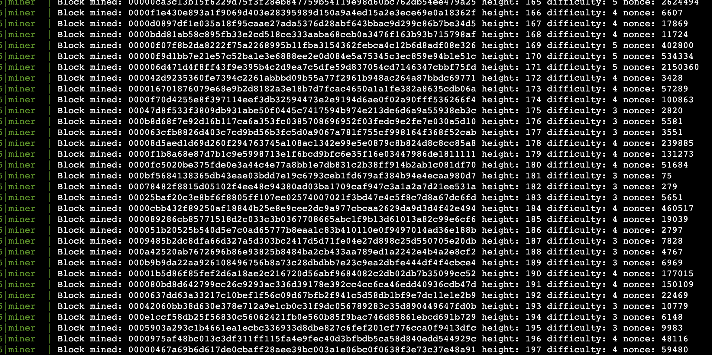

# js-particles POW Blockchain Miner

Welcome to `js-particles`, a sleek and efficient proof-of-work blockchain miner crafted in JavaScript.

## 📖 Table of Contents

- [Prerequisites](#prerequisites)
- [Installation](#installation)
- [Usage](#usage)
- [Contract Configuration](#contract-configuration)
- [Logs & Output](#logs-output)

## 🚀 Prerequisites

Before diving in, ensure your system is equipped with:

- [Node.js](https://nodejs.org/) (v16 or above)
- [npm](https://www.npmjs.com/) (v7 or above)

## 📜 Contract Configuration

1. **Environment Magic**:
   Begin by conjuring a `.env` file from `.env.sample`. Make sure to infuse it with a genuine wallet address.

## 🛠 Installation

### Step 1: Install Dependencies

If you haven't embraced Yarn yet:

```bash
npm install -g yarn
```

Next, pull in the project dependencies:

```bash
yarn install
```

### Step 2: Ignite the Miner

Fire up the mining process with:

```bash
node miner.js
```

## 🔧 Usage

### Checking Balance

Peek into the balance for any address:

```bash
node cmd.js getBalance --address YOUR_ADDRESS_HERE
```

### Sending Particles

To transfer particles:

```bash
node cmd.js sendTransaction --to DESTINATION_ADDRESS --amount AMOUNT_TO_SEND
```

## 🖼 Logs & Output

Witness the symphony of the mining process:


